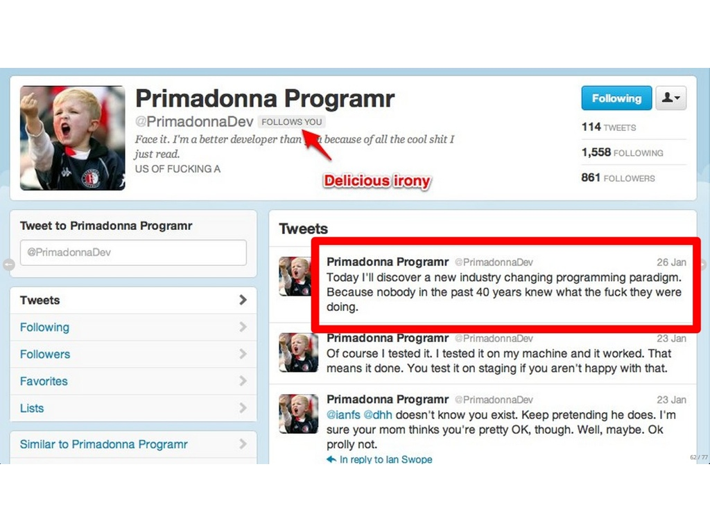

# Frustration Driven Development

!SLIDE bottom-left

# Frustration Driven Development

}}} images/FFFFFUUUUUUU-.png

!SLIDE middle

# Evan Light
## [@elight](http://twitter.com/elight)
## [evan.light@tripledogdare.net](mailto:evan.light@tripledogdare.net)


!SLIDE bottom-left

# How I feel on any given day

}}} images/vader.jpg


!SLIDE top-right

# Yet I want to feel like...

}}} images/dalai-lama.jpg


!SLIDE bottom-left

# How did I get this way?

}}} images/bushy.jpg


!SLIDE top-right

}}} images/usgovt.png


!SLIDE top-right

}}} images/bubble.png


!SLIDE top-right

}}} images/bizhell.jpg


!SLIDE top-left

# I've been doing this a while...

}}} images/atari400.jpg


!SLIDE top-right

# I've seen a lot of crap!

}}} images/crap.jpg


!SLIDE bottom-left

# It pisses me off...

}}} images/angry.jpg


!SLIDE

}}} images/fear-anger-hate.jpg


!SLIDE bottom-left

# Let's talk about hate

}}} images/jarjar.jpg::mangaholix::::http://mangaholix.deviantart.com/art/Kriss-HATES-Jar-Jar-Binks-163018356


!SLIDE bottom-right

# Writing presentations

}}} images/writing-presentations.jpg


!SLIDE

# Blank page syndrome


!SLIDE

# Outlining a.k.a TDD


!SLIDE bottom-left

}}} images/mil.jpg


!SLIDE

# Can't mind her own business!


!SLIDE

# SRP violation

``` ruby
class User < ActiveRecord::Base
  # Elided for your sanity
  # Yes, this was real code
  # Yes, I helped write it...

  include User::Associations
  include User::Validations
  include User::Search
  include User::DefaultSettings
  include User::DefaultPrivacies
  include User::Invitations

  # even more fucking includes ...
end
```


!SLIDE

# DCI to the rescue!

``` ruby
class SessionsController < ApplicationController
  def create
    # ...
    user = find_or_create_from_oauth_data(oauth_data)
    # ...
  end

  def find_or_create_from_oauth_data(oauth_data)
    # ...
    User.new.tap do |user|
      user.extend NewUserProvisioner
      user.provision_with oauth_data
      user.save!
    end
  end
end
```

##### Lifted and slightly tweaked from [here](https://github.com/rubypair/rubypair/blob/master/app/controllers/sessions_controller.rb)


!SLIDE bottom-left

# Monkey rape

}}} images/monkey-rape.gif


!SLIDE

## Protip
### Be careful what you google
### What is seen cannot be unseen
##### Helpful hint: "[monkey raping](https://www.google.com/search?q=monkey+raping&hl=en&safe=off)"


!SLIDE

``` ruby
module Resque
  class Worker
    alias_method :unregister_worker_without_before_hook, :unregister_worker

    def unregister_worker
      run_hook(:before_unregister_worker, self)
      unregister_worker_without_before_hook
    end

    # Unforunately have to override Resque::Worker's +run_hook+ method to call hook on
    # APN::QueueManager rather on Resque directly. Any suggestions on
    # how to make this more flexible are more than welcome.

    def run_hook(name, *args)
      # ...
      # elight: 4 hours of my life... gone
    end
  end
end

```


!SLIDE

</img>

``` ruby
# Unforunately have to override Resque::Worker's +run_hook+ method to call hook on
# APN::QueueManager rather on Resque directly.
```


!SLIDE top-left

# Dependency injection

}}} images/needle.jpg


!SLIDE

# Violating Demeter
### Encapsulation


!SLIDE

## Callbacks / Observer Pattern
### Tracing them is a PITA
### Use in ***small doses***


!SLIDE

# Blithe indifference to opinions of others


!SLIDE

# Remember this guy?

</img>

!NOTE
* Be sensitive to your team's skill level
* Learn what your team knows and what they don't
* Write code that most of your team can understand


!SLIDE

# Wearing your genius cap
### Do it in isolation
### Document the fuck out of it


!SLIDE

# Breaking convention
### non-RESTlike Rails controllers
### "match" routes


!SLIDE

# Predictable code is good!
### Does not have to be repetitive
### Think "the typical Rails controller"
### More surprises = Greater WTFs/minute

!SLIDE

# Naming
### Intent revealing
### Put some effort into it
### Joining "User" and "Teams" and call the class "UserTeams"? Buy a fucking thesaurus!


!SLIDE

### Patterns are handy
### You have work to do
### Use what you know
### Know what you don't
### Get shit done


!SLIDE

# Now do some fucking work
### Thank you
